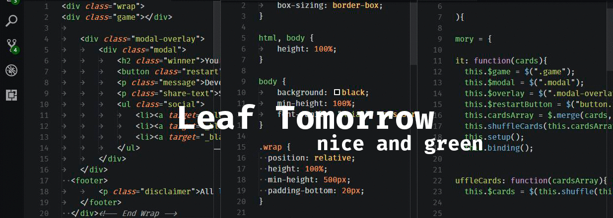

# Base16 **Leaf Tomorrow** Dark Theme for VSCode

☘️ Less red, more green + tons of small improvements 👽🥑🔋  
Since _Tomorrow_ just felt too red to me, I replaced that color with a nice green.
Out came a less red and more green version of Base16 Tomorrow Dark Theme with some modifications in secondary colors.
Now also optimised for writing distraction-free in markdown. It displays **bold bold** and _italic in italics_.  



Based on _Base16 Tomorrow Dark+_ Theme by Shurelia.

Recommended fonts are Fira Code or Source Code Pro.
For Markdown, [iA Writer Duospace](https://github.com/iaolo/iA-Fonts/tree/master/iA%20Writer%20Duospace) is amazing.  
Matching file icon themes are "Seti" or "File icons".

To install the, search for 'Leaf Tomorrow' in the extensions panel.

[Theme in the VSCode marketplace](https://marketplace.visualstudio.com/items?itemName=swjh.base16-leaf-tomorrow-vscode)

[Repository on github](https://github.com/simonhermann/base16-leaf-tomorrow-vscode-theme)
<br>


```json
/*Some suggested settings:*/
"editor.renderWhitespace": "boundary",
"window.menuBarVisibility": "hidden",
```


