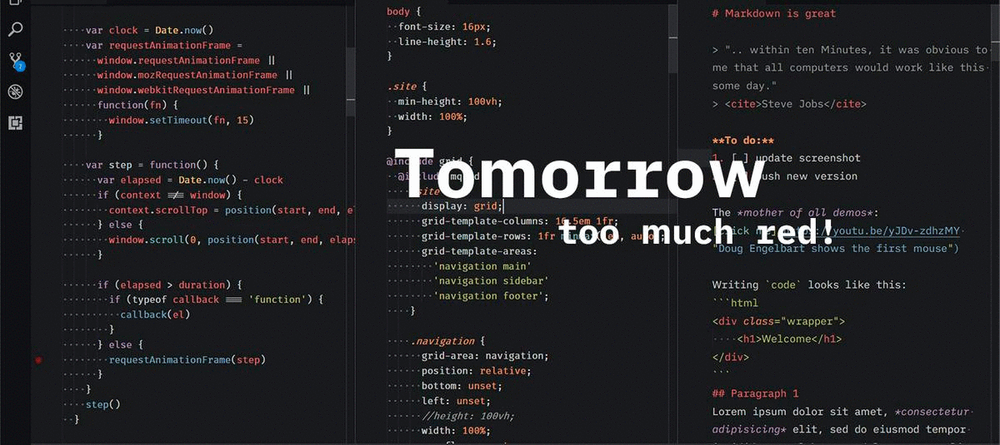

# Base16 **Leaf Tomorrow** Dark Theme for VSCode
Since Tomorrow felt too red to me, I replaced it by a nice green.

Works great with markdown, since it displays **bold bold** and *italic in italics*.
Based on *Base16 Tomorrow Dark+* Theme by Shurelia

**Colors**
green1: #8CB978
green2: #275511 (only used for activityBar badges)
